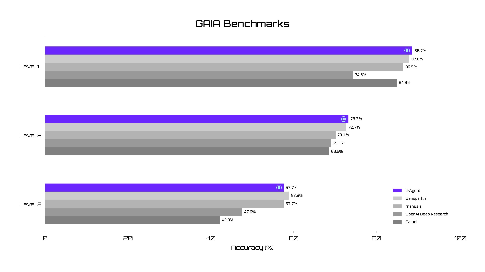

# II-Agent

<div align="center">

[](https://github.com/Intelligent-Internet/ii-agent/stargazers)
[](https://discord.gg/intelligentinternet)
[](https://opensource.org/licenses/Apache-2.0)
[](https://ii.inc/web/blog/post/ii-agent)
[](https://ii-agent-gaia.ii.inc/)
[](https://deepwiki.com/Intelligent-Internet/ii-agent)

</div>

<p align="center">
  <a href="https://trendshift.io/repositories/14389" target="_blank">
    
  </a>
</p>


II-Agent is an open-source intelligent assistant designed to streamline and enhance workflows across multiple domains. It represents a significant advancement in how we interact with technology—shifting from passive tools to intelligent systems capable of independently executing complex tasks.

### Join Us on Discord

📢 Join Our [Discord Channel](https://discord.gg/yDWPsshPHB)! Looking forward to seeing you there! 🎉

## Introduction

<https://github.com/user-attachments/assets/2707b106-f37d-41a8-beff-8802b1c9b186>

## (New Features) Full-stack Web Agent Showcases!

https://github.com/user-attachments/assets/8399f494-1e5a-43ba-9c7b-32861c51075e

https://github.com/user-attachments/assets/647e6bae-bc62-4c8b-9e6e-a7c8946caf56

## Overview

II-Agent is built around providing an agentic interface to leading language models. It offers:

- A CLI interface for direct command-line interaction
- A WebSocket server that powers a modern React-based frontend
- Integration with multiple LLM providers:
  - Anthropic Claude models (direct API or via Google Cloud Vertex AI)
  - Google Gemini models (direct API or via Google Cloud Vertex AI)

## GAIA Benchmark Evaluation

II-Agent has been evaluated on the GAIA benchmark, which assesses LLM-based agents operating within realistic scenarios across multiple dimensions including multimodal processing, tool utilization, and web searching.

We identified several issues with the GAIA benchmark during our evaluation:

- **Annotation Errors**: Several incorrect annotations in the dataset (e.g., misinterpreting date ranges, calculation errors)
- **Outdated Information**: Some questions reference websites or content no longer accessible
- **Language Ambiguity**: Unclear phrasing leading to different interpretations of questions

Despite these challenges, II-Agent demonstrated strong performance on the benchmark, particularly in areas requiring complex reasoning, tool use, and multi-step planning.


You can view the full traces of some samples here: [GAIA Benchmark Traces](https://ii-agent-gaia.ii.inc/)

## Requirements

- Docker Compose
- Python 3.10+
- Node.js 18+ (for frontend)
- At least one of the following:
  - Anthropic API key, or
  - Google Gemini API key, or
  - Google Cloud project with Vertex AI API enabled

> \[!TIP]
>
> - For best performance, we recommend using Claude Sonnet 4 or Claude Opus 4 models.
> - For fast and cheap, we recommend using GPT-4.1 from OpenAI.
> - Gemini 2.5 Pro is a good balance between performance and cost.

## Installation

### Docker Installation (Recommended)

1. Clone the repository
2. Run the following command

```
chmod +x start.sh
./start.sh
```


Our II-Agent supports popular models such as Claude, Gemini, and OpenAI. If you’d like to use a model from OpenRouter, simply configure your OpenAI endpoint with your OpenRouter API key.
If you are using Vertex, run with these variables

```
chmod +x start.sh
GOOGLE_APPLICATION_CREDENTIALS=absolute-path-to-credential ./start.sh
```


(Optional) You can fill Google API credentials to connect to google drive. Press enter to skip these steps

### Runtime Environment


You can now select from a variety of models, set your API key, and configure environments—all directly from the frontend settings page—to equip your agents with powerful tools and capabilities. You can also change the agents' runtime environment. Currently, we support three runtime modes: Local, Docker, and E2B. For full-stack web application development, Docker and E2B are highly recommended, while Local Mode is best suited for lighter tasks such as basic webpage building and research.

In addition, agents come equipped with built-in NeonDB and Vercel integration, enabling seamless cloud deployment of full-stack applications using a serverless database and serverless infrastructure.

## Core Capabilities

II-Agent is a versatile open-source assistant built to elevate your productivity across domains:

| Domain                        | What II‑Agent Can Do                                                                                       |
| ----------------------------- | ---------------------------------------------------------------------------------------------------------- |
| Research & Fact‑Checking      | Multistep web search, source triangulation, structured note‑taking, rapid summarization                    |
| Content Generation            | Blog & article drafts, lesson plans, creative prose, technical manuals, Website creations                  |
| Data Analysis & Visualization | Cleaning, statistics, trend detection, charting, and automated report generation                           |
| Software Development          | Code synthesis, refactoring, debugging, test‑writing, and step‑by‑step tutorials across multiple languages |
| Dynamic Website Development |Full-stack web application creation with live hosting, framework templates, and real-time deployment     |
| Workflow Automation           | Script generation, browser automation, file management, process optimization                               |
| Problem Solving               | Decomposition, alternative‑path exploration, stepwise guidance, troubleshooting                            |

## Methods

The II-Agent system represents a sophisticated approach to building versatile AI agents. Our methodology centers on:

1. **Core Agent Architecture and LLM Interaction**

   - System prompting with dynamically tailored context
   - Comprehensive interaction history management
   - Intelligent context management to handle token limitations
   - Systematic LLM invocation and capability selection
   - Iterative refinement through execution cycles

2. **Planning and Reflection**

   - Structured reasoning for complex problem-solving
   - Problem decomposition and sequential thinking
   - Transparent decision-making process
   - Hypothesis formation and testing

3. **Execution Capabilities**

   - File system operations with intelligent code editing
   - Command line execution in a secure environment
   - Advanced web interaction and browser automation
   - Task finalization and reporting
   - Specialized capabilities for various modalities (Experimental) (PDF, audio, image, video, slides)
   - Deep research integration

4. **Context Management**

   - Token usage estimation and optimization
   - Strategic truncation for lengthy interactions
   - File-based archival for large outputs

5. **Real-time Communication**
   - WebSocket-based interface for interactive use
   - Isolated agent instances per client
   - Streaming operational events for responsive UX

## Conclusion

The II-Agent framework, architected around the reasoning capabilities of large language models like Claude Sonnet 4 or Gemini 2.5 Pro, presents a comprehensive and robust methodology for building versatile AI agents. Through its synergistic combination of a powerful LLM, a rich set of execution capabilities, an explicit mechanism for planning and reflection, and intelligent context management strategies, II-Agent is well-equipped to address a wide spectrum of complex, multi-step tasks. Its open-source nature and extensible design provide a strong foundation for continued research and development in the rapidly evolving field of agentic AI.

## Acknowledgement

We would like to express our sincere gratitude to the following projects and individuals for their invaluable contributions that have helped shape this project:

- **AugmentCode**: We have incorporated and adapted several key components from the [AugmentCode project](https://github.com/augmentcode/augment-swebench-agent). AugmentCode focuses on SWE-bench, a benchmark that tests AI systems on real-world software engineering tasks from GitHub issues in popular open-source projects. Their system provides tools for bash command execution, file operations, and sequential problem-solving capabilities designed specifically for software engineering tasks.

- **Manus**: Our system prompt architecture draws inspiration from Manus's work, which has helped us create more effective and contextually aware AI interactions.

- **Index Browser Use**: We have built upon and extended the functionality of the [Index Browser Use project](https://github.com/lmnr-ai/index/tree/main), particularly in our web interaction and browsing capabilities. Their foundational work has enabled us to create more sophisticated web-based agent behaviors.

We are committed to open source collaboration and believe in acknowledging the work that has helped us build this project. If you feel your work has been used in this project but hasn't been properly acknowledged, please reach out to us.
